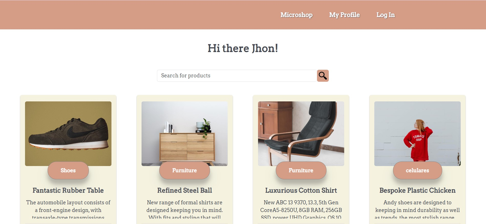

# MICROSHOP PRÁCTICA VUE.JS Y TYPESCRIPT

## Autora: Mª Ángeles Córdoba

## Bootcamp _Mujeres en Tech_ by KeepCoding

Aplicación que simula una pequeña tienda, llamada MicroShop, desarrollada con Vue.js, Vuex y Axios usando Typescript.

La aplicación recoge datos de una APi de la siguente API de pruebas:
https://fakeapi.platzi.com/

## Autentificación / Log in\*

**Email : ** john@mail.com
**Password : ** changeme

Se debe consultar la documentación de la API en caso de error con el usuario y elegir cualquier usuario que devuelva la siguiente petición:

```
[GET] https://api.escuelajs.co/api/v1/users
```

## Demo





## Puesta en marcha

Project setup

```
npm install
```

Compiles and hot-reloads for development

```
npm run serve
```

Compiles and minifies for production

```
npm run build
```

Lints and fixes files

```
npm run lint
```
